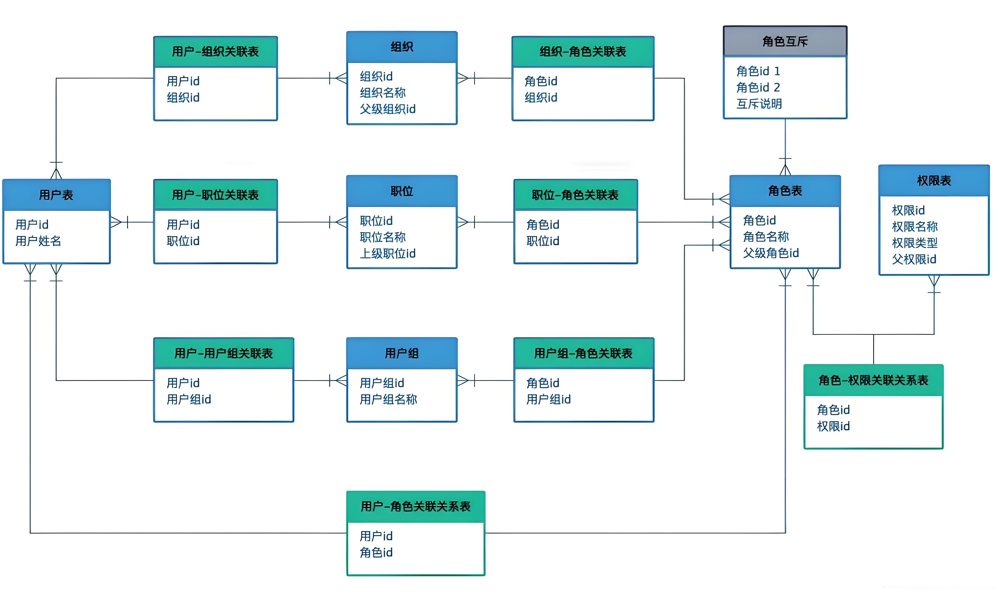

# tomato-engine
记录自己的日常工作

## 工作日志

 [tomato-engine-db](tomato-engine-db) 

- MySQL json 示例

[tomato-engine-util](tomato-engine-util)

- BigDecimal 工具类

[tomato-engine-spring-util](tomato-engine-spring-util)

- spring 上下文工具类
- Spring BeanUtils 简单包装

 [tomato-engine-mybatis](tomato-engine-mybatis) 

- sql 分析拦截器
- mybatis-mp：基于 mybatis ORM 框架 mybatis-mp

 [tomato-engine-starter](tomato-engine-starter) 

- spring boot starter 基础依赖

 [tomato-engine-web](tomato-engine-web) 

- 日志记录
- 请求包装器、响应包装器
- Xss 过滤器
- TODO 全局加解密

[tomato-engine-thread](tomato-engine-thread)

- 虚拟线程

[tomato-engine-idempotent](tomato-engine-idempotent)

- 幂等
- 页面做遮罩，数据库层面的唯一索引，先查询再添加
- 此注解只用于幂等，不用于锁

[tomato-engine-login](tomato-engine-login)

时间与成本，收益与支出的博弈。

- 唯一性判断：手机号、邮箱
- 登录敏感词检测：分词、DFA算法
- 短信轰炸：滑块验证、2FA -->签名-->请求（数字签名）
- 限流：限流只能起到一定的约束作用，不能影响到真正的用户使用
- https双向认证
- code采用加密（如AES）：客户端也可以被破解
- 谷歌验证码v3+v2
- 接口域名校验：适用于大部分场景的web方案，开放平台之类的就不适用
- 短信服务预付费模式

[tomato-engine-jackson](tomato-engine-jackson)

- jackson
- 数据脱敏
- xss 过滤

 [tomato-engine-easy-excel](tomato-engine-easy-excel) 

- easy-excel
- 时间转换

[tomato-engine-rbac](tomato-engine-rbac)

- 权限
  - 页面权限、菜单权限、按钮权限等
  - 菜单也分一级菜单、二级菜单甚至三级菜单
  - 树形结构
- 角色
  - 权限分配给角色
  - 角色和权限是多对多的关系

- 用户组：
  - 用户组是一群用户的组合，而角色是用户和权限之间的桥梁。一个用户组可以是一个职级，可以是一个部门，可以是一起做事情的来自不同岗位的人。
  - 角色和用户组是多对多的关系
- 权限组
  - 解决权限和角色对应关系复杂的问题
  - 较少使用
- RBAC1：角色继承的RBAC模型
  - 角色继承：上层角色继承下层角色的所有权限，并且可以额外拥有其他权限。

- RBAC2：带约束的RBAC模型
  - 角色互斥：A 用户不能即有审核角色和提交角色，或者说不能审核自己提交的内容（代码控制）。
  - 基数约束：角色用户数量。
  - 先决条件约束：A 是 CEO 那么首先也必须是普通员工。
- 组织
  - 权限的分配可以根据组织架构来划分
  - 控制数据权限
  - 角色和组织是多对多的关系
- 职位
  - 一个组织下面会有很多职位
  - 用户跟职位的对应关系时一对一的关系
  - 角色和职位是多对多的关系

## 生产力工具

沉浸式翻译（内存占用较高）：https://immersivetranslate.com/zh-Hans/ 

Redis 客户端 ：https://redis.tinycraft.cc/

git 客户端：https://git-fork.com/

Arc 浏览器：https://arc.net/

Mac菜单栏 iBar：https://www.better365.cn/ibar.html

Mac 搜索 Raycast：https://www.raycast.com/

远程桌面：https://www.todesk.com/

## 开源项目推荐

本项目参考代码如下：

> https://github.com/pig-mesh/idempotent-spring-boot-starter/tree/features/springboot3
>
> https://github.com/jd-opensource/sql-analysis
>
> https://github.com/zzusp/slow-sql-monitor
>
> https://github.com/pig-mesh/pig
